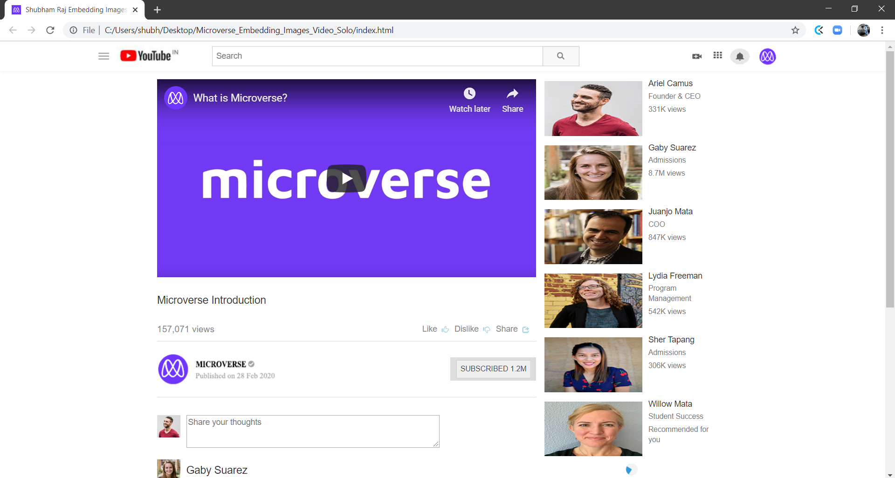

# Microverse_Embedding_Images_Video_Solo

>The goal here is to produce an exact replica of the YouTube video page.

Additional description about the project and its features.

## Built With

- HTML,
- CSS,
- Visual Studio Code

## Getting Started

**This is an example of how you may give instructions on setting up your project locally.**
**Modify this file to match your project, remove sections that don't apply. For example: delete the testing section if the currect project doesn't require testing.**

To get a local copy up and running follow these simple example steps.

git clone https://github.com/shubham14p3/Microverse_Embedding_Images_Video_Solo.git

### Deployment

Additional Microverse Requirements

## Section

## Navigation bar
It has an embedded image that represents a logo.
The logo is aligned to the leftmost part of the navbar.
It has an input tag that represents a search bar.
The search bar is aligned to the middle of the navbar.
It has a button tag that represents the search button.
The search button is at the end (rightmost part) of the search bar.
It has at least three embedded images on the rightmost part of the navbar that represent icons and/or an avatar.

## Video
It is displayed.
It shows the video title.
It shows the number of views.
It has like and dislike icons.
It has a share button.
It shows the avatar of the user who uploaded the video.
It has a subscribe button.

## Sidebar Recommended videos
It shows the recommended video’s thumbnail preview (as image not as an actual video).
It shows the title of the video.
It shows the number of views.

## Authors

👤 **Shubham**

- Github: [@shubham14p3](https://github.com/shubham14p3/)
- Linkedin: [@shubham14p3](https://linkedin.com/shubham14p3)

## 🤝 Contributing

Contributions, issues and feature requests are welcome!

Feel free to check the [issues page](https://github.com/shubham14p3/Microverse_Embedding_Images_Video_Solo/issues).

## Show your support

Give a ⭐️ if you like this project!

## 📝 License

This project is [MIT](lic.url) licensed.
